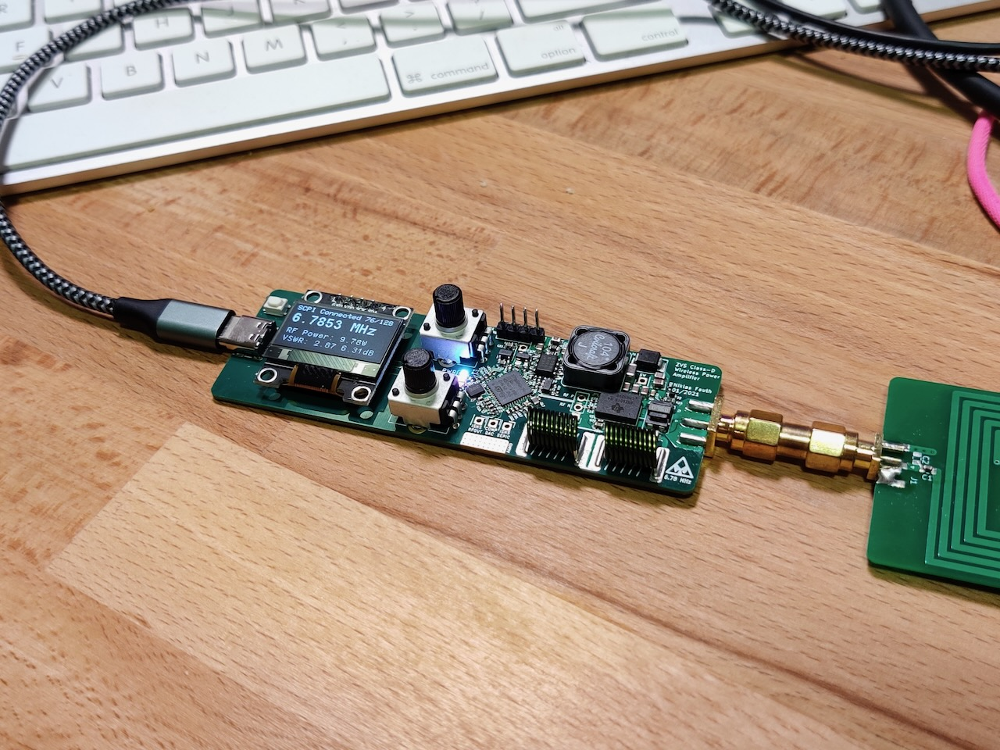
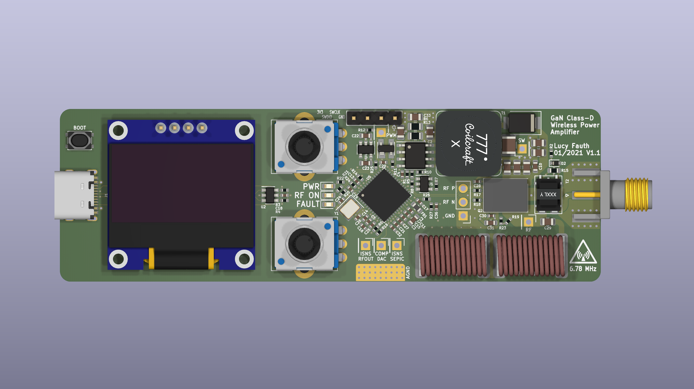
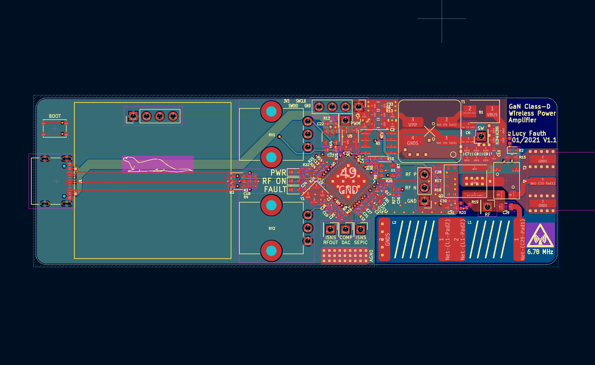
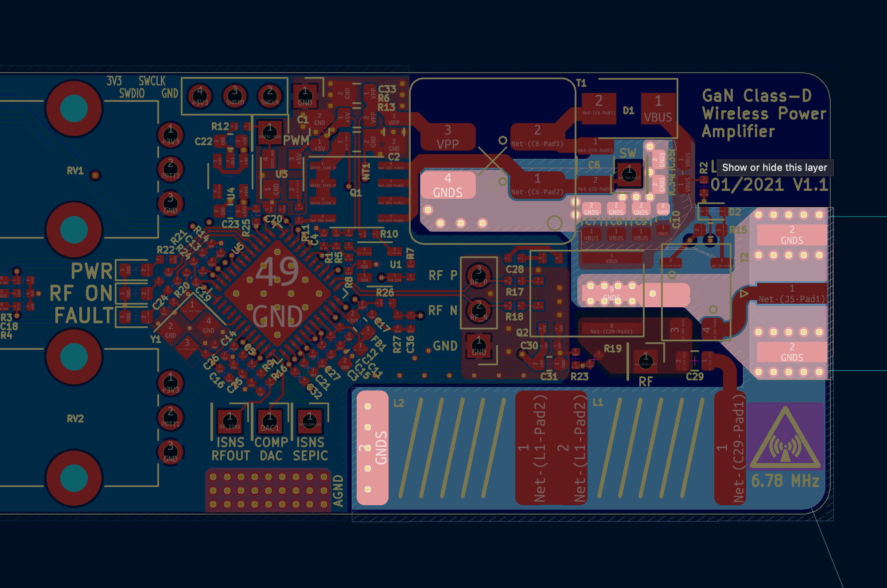

# GaN Class-D Wireless Power Amplifier

A software-defined 6.78 MHz GaN power amplifier development kit for wireless power transfer (WPT) research and antenna tuning. Built around the STM32G4 microcontroller with its 5.4 GHz / 184 ps high-resolution timer (HRTIM).

I designed this board because I wanted a signal generator that was more capable than just generating a static waveform.
For familiarizing myself with wireless power transfer and getting a feeling for antenna and magnetic design, I wanted a source-meausure-unit (SMU) for RF,
something that could generate and also measure RF output. I also wanted all settings and measurements to be easily controllable and readable such that I could easily script testbenches in python for plotting parameter sweeps, or prototype control loops critical for real-world WPT like resonance tracking or constant output power control.

I finished this project in winter 2020, and it became an invaluable tool throughout 2021 for designing a custom wireless charging solution.


*Assembled development board showing real-time status on OLED display: frequency, RF power, and VSWR measurements*

## Features

- **6.78 MHz ISM Band Operation** — Optimized for the AirFuel/Qi extended power profile frequency band
- **Software-Defined RF Generation** — Real-time frequency and deadtime adjustment via software
- **Integrated SEPIC Converter** — Programmable amplifier supply voltage (0–20V) with USB / input current limiting
- **SCPI over USB CDC** — Standard instrument control protocol for automated test benches
- **OLED Status Display** — Real-time frequency, power, and VSWR monitoring
- **Analog Knob Inputs** — Two potentiometers which can be read via SCPI to control any parameter. (or you can use these ADC inputs to measure ie. voltage and current in the WPT receiver and plot them along input power for efficiency sweeps

## Applications

- Wireless power transfer research and development
- Antenna impedance matching and tuning, efficiency testing
- Inductive heating experiments, plasma generation
- Generic educational RF / power electronics platform

## Wireless Power Demo


*Demonstration setup: PCB spiral coil antennas (transmit and receive) wirelessly powering an LED strip at 6.78 MHz*

## Hardware Specifications

| Parameter | Value |
|-----------|-------|
| Operating Frequency | 10 kHz – 10 MHz |
| HRTIM Resolution | 184 ps (144 MHz × 32 multiplier) |
| Deadtime Range | 0–511 counts (×8 prescaler, ~1.1 ns steps) |
| Amplifier Supply | 0–20V (SEPIC regulated) |
| Input Current Limit | Programmable, default 3A |
| Input Voltage | 5V USB-C |
| Control Interface | USB CDC (Virtual COM Port) |
| MCU | STM32G474 (170 MHz Cortex-M4F) |

## PCB Design

### 3D Rendering


*3D render of the assembled board with all components*

### Board Layout


*Full board layout showing component placement: USB-C input (left), OLED display, SEPIC converter (top right), STM32G4 MCU, GaN half-bridge (center right), and output matching network (bottom right)*

### Critical Design: Ground Plane and Return Path


*PCB layout highlighting the ground plane structure around the GaN switching stage*

High-frequency switching at 6.78 MHz with fast edge rates demands careful attention to parasitic inductance in the power loop. Key design decisions implemented in this layout:

**Minimizing Loop Inductance:**
- **Tight Component Placement** — The GaN FETs, gate drivers, and decoupling capacitors are placed as close as possible to minimize the physical area of the switching current loop
- **Direct Via Stitching** — Multiple vias connect the top-side ground pads directly to the internal ground plane, reducing the inductance of the return path
- **Solid Ground Reference** — An unbroken ground plane beneath the switching node provides a low-inductance return path for high-frequency currents with a single net tie to DGND
- **Thermal Relief Considerations** — Ground connections to the FET source pads use sufficient via count to handle both thermal dissipation and the high-frequency return currents

## Schematic

📄 **[Download Full Schematic (PDF)](hardware/schematic_V1.2/charge-hf.pdf)**

The schematic is organized into functional blocks:

```
┌─────────────────┐   ┌─────────────────┐   ┌─────────────────┐   ┌─────────────────┐
│   USB-C Input   │──▶│   SEPIC DCDC    │──▶│  GaN Half-Bridge│──▶│   RF Output     │
│   + ESD Prot.   │   │   5V → 0-20V    │   │   LMG5200       │   │   I & U Sense   │
└────────┬────────┘   └────────┬────────┘   └────────┬────────┘   └─────────────────┘
         │                     │                     │
         │            ┌────────┴────────┐            │
         └───────────▶│   STM32G474     │-───────────┘
                      │   HRTIM + ADC   │
                      │   USB CDC SCPI  │
                      └─────────────────┘
```

## Circuit Design Notes

### Power Stage: LMG5200 GaN Half-Bridge

The heart of the RF amplifier is the **Texas Instruments LMG5200**, a fully integrated 80V/10A GaN half-bridge power stage. This device integrates both high-side and low-side GaN FETs along with their gate drivers in a single 6×8mm QFN package.

**Why use an integrated module?**

- **Minimized Parasitics** — The gate driver and GaN FETs are co-packaged with optimized bond wire lengths, achieving lower gate loop inductance than any discrete solution. This is critical at 6.78 MHz where even 1nH of stray inductance causes significant ringing.
- **Simplified Layout** — A single component eliminates the need to route high-speed gate drive signals across the PCB, reducing EMI and layout complexity.
- **Thermal Co-location** — Both FETs share a common thermal pad, simplifying heatsinking.

### SEPIC DC-DC Converter

The amplifier supply (VPP) is generated by a SEPIC topology, chosen for its ability to both step-up and step-down while providing a non-inverted output. This allows operation from 5V USB while generating 0–20V for the GaN stage.

**Key components:**

- **Si4058 (Q1)** — Low Rds(on) N-channel MOSFET handles the primary switching
- **MIC4416 (U3)** — Low-side gate driver with enable control, driven directly from STM32 HRTIM Timer D

**Feedback and control:**

- **Voltage Sensing** — A resistive divider (100k/5.1k) scales VPP down to ADC range
- **Current Sensing** — A 10mΩ shunt (R13) with a Si8540 current sense amplifier measures input current for overcurrent protection and constant power control
- **Digital Control Loop** — The STM32 implements a PI controller in the HRTIM repetition interrupt, adjusting duty cycle based on voltage error with current limiting

### USB Power Input

The design operates from USB-C with proper PD support:

- **USBLC6-4 (U2)** — ESD protection on D+/D- and CC lines
- **CC1/CC2 Resistors (R3, R4)** — 5.1kΩ pull-downs advertise the device as a UFP (sink) for default 5V/3A
- **UCPD Peripheral** — The STM32G4's built-in USB-PD controller connects to CC1/CC2 for potential USB-PD negotiation (firmware support for higher voltages possible)

### RF Output Network

The Class-D output is filtered and can be impedance-matched to an antenna:

- **LC Resonant Tank (L1, L2, C29)** — Two 390nH inductors and a 1µF capacitor form a series-resonant network tuned near 6.78 MHz. The tank filters the square wave output and provides the sinusoidal current needed for efficient WPT.
- **CST7030-020LB (T2)** — A 1:20 turns ratio current transformer plus shunt resistor are used for sensing AC output current

### STM32G474 Configuration

The STM32G474CB provides the digital control:

- **HRTIM Timer C** — Generates complementary PWM for the GaN half-bridge with programmable deadtime
- **HRTIM Timer D** — Drives the SEPIC converter with separate frequency/duty control
- **ADC2** — Continuous DMA-driven sampling of voltages, currents, and potentiometer inputs
- **DAC1/DAC3** — Provide reference voltages for the analog comparators (overcurrent protection)
- **I2C1** — Drives the OLED status display
- **USB** — CDC virtual COM port for SCPI communication

## SCPI Command Reference

The amplifier implements SCPI (Standard Commands for Programmable Instruments) over USB CDC. Connect using any serial terminal or VISA library at the default USB CDC settings.

### Identification Commands

| Command | Description | Example Response |
|---------|-------------|------------------|
| `*IDN?` | Query device identification | `Manufacturer,Model,Serial,Version` |
| `*RST` | Reset device to default state | — |
| `*TST?` | Self-test query | `0` (pass) or `1` (fail) |
| `*CLS` | Clear status registers | — |
| `*OPC?` | Operation complete query | `1` |

### Measurement Commands

| Command | Description | Returns |
|---------|-------------|---------|
| `MEASure:VOLTage:DC:INput?` | Read USB input voltage | Voltage in V (float) |
| `MEASure:VOLTage:DC:OUTput?` | Read amplifier supply voltage | Voltage in V (float) |
| `MEASure:CURRent:DC:INput?` | Read input current | Current in A (float) |
| `MEASure:VOLTage:DC:CONTrol? <n>` | Read potentiometer voltage | Voltage in V (float) |

**Example:**
```
> MEAS:VOLT:DC:IN?
< 5.032

> MEAS:VOLT:DC:OUT?
< 12.45

> MEAS:CURR:DC:IN?
< 0.856

> MEAS:VOLT:DC:CONT? 1
< 1.65
```

### Configuration Commands

| Command | Parameters | Description |
|---------|------------|-------------|
| `CONFigure:VOLTage:DC:OUTput <V>` | Voltage (0–30V) | Set amplifier supply voltage |
| `CONFigure:CURRent:DC:INput <A>` | Current (0–3A) | Set input current limit |
| `CONFigure:FREQuency <Hz>` | Frequency (10000–15000000) | Set RF output frequency |
| `CONFigure:DEADtime <rising>,<falling>` | 0–511 each | Set half-bridge deadtime |

**Example:**
```
> CONF:VOLT:DC:OUT 15
< OK

> CONF:FREQ 6780000
< OK

> CONF:DEAD 20,20
< OK
```

### System Commands

| Command | Description |
|---------|-------------|
| `SYSTem:ERRor?` | Query and clear oldest error |
| `SYSTem:ERRor:COUNt?` | Query number of errors in queue |
| `SYSTem:VERSion?` | Query SCPI version |
| `STATus:QUEStionable?` | Query questionable status register |


## Python Examples

Example scripts are provided in the [`software/`](software/) directory demonstrating SCPI communication via PyVISA.

Thanks to SCPI integration for both setting parameters and reading output power, it is very easy to build custom testbenches to characterize ie. efficiency over frequency and plot the results using matplotlib or similar.

### Basic Control — [`control.py`](software/control.py)

This script provides interactive control using the two onboard potentiometers. It continuously reads the knob positions via `MEAS:VOLT:DC:CONTrol?`, maps them to frequency (1–8 MHz) and output voltage (0–30V), and updates the amplifier settings in real-time. The display shows actual measured values including calculated input power.

**Usage:**
```bash
python software/control.py
```

### Custom Scripts

For custom automation, connect using PyVISA with the `@py` backend:

```python
import pyvisa as visa
rm = visa.ResourceManager('@py')
amp = rm.open_resource("ASRL/dev/ttyACM0::INSTR")
print(amp.query("*IDN?"))
```

On Windows, the resource string will be `ASRL<n>::INSTR` where `<n>` is the COM port number assigned to the USB CDC device.

## Building the Firmware

### Prerequisites

- ARM GCC Toolchain
- STM32CubeMX (for regenerating HAL code if needed)
- OpenOCD or ST-Utils for flashing

### Compilation

```bash
cd firmware
make
```

### Flashing

```bash
# Using OpenOCD
openocd -f interface/stlink.cfg -f target/stm32g4x.cfg -c "program build/main.elf verify reset exit"

# Or using ST-Link utility
st-flash write build/main.bin 0x8000000
```

## License

Hardware design files: MIT license 
Firmware: MIT license 
Software: MIT license
3rd party Firmware: BSD 3-Clause (STM32 HAL), BSD 2-Clause (SCPI library)

## Author

Lucia Fauth — Rev 1.2 (February 2021)
